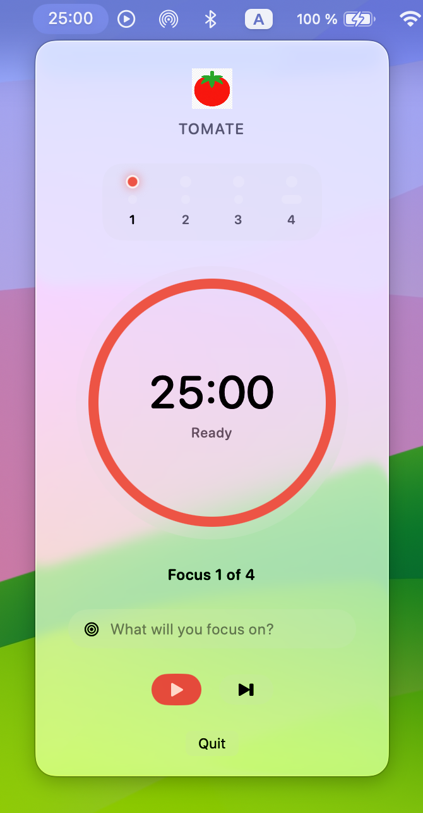

# Tomate

Tomate (tomato in portuguese) is a minimalist macOS menu bar Pomodoro timer. Tomate lives in the menu bar, shows the remaining time at a glance, and opens a Liquid Glass popover for play, pause, and skip.

<p align="center">
  
</p>

## Features

- Menu bar countdown (`MM:SS`) so the timer stays visible while you work
- 25-minute focus sessions with play/pause and skip
- Set a focus intent before starting each session (locked once running)
- Circular remaining-time ring in a compact popover
- Liquid Glass controls (Play/Pause, Skip, Quit)
- Runs as a menu bar extra (no Dock icon or main window)
- Date-based countdown so time stays accurate when the popover is closed
- Custom sounds: Alarm.mp3 when a focus session ends, Break.mp3 when a break ends

## Requirements

- macOS 26.2 or later
- Xcode 26 or later

## Getting started

Clone the repo:

```bash
git clone https://github.com/anpa/tomate.git
cd tomate
```

Then:

1. Open `Tomate.xcodeproj` in Xcode.
2. Select the **Tomate** scheme.
3. Build and run (`⌘R`).

After launch, look at the right side of the menu bar for the countdown. Click it to open the popover.

If an older Tomate process is still running, quit it from Activity Monitor before launching a new build.

## Project layout

```
Tomate/
  TomateApp.swift       # MenuBarExtra entry point
  AppDelegate.swift     # Keeps the app alive with no windows
  ContentView.swift     # Popover UI
  PomodoroTimer.swift   # 25-minute session logic
  Assets.xcassets/      # App icon, menu bar art, tomato image
  Resources/            # Audio: Alarm.mp3, Break.mp3
Tomate.xcodeproj/
```

## Contributing

Issues and pull requests are welcome. For a change:

1. Fork the repository and create a branch.
2. Open `Tomate.xcodeproj`, make your edits, and run the app from Xcode.
3. Open a pull request that explains what you changed and why.

## License

Tomate is free and open source under the [MIT License](LICENSE).
